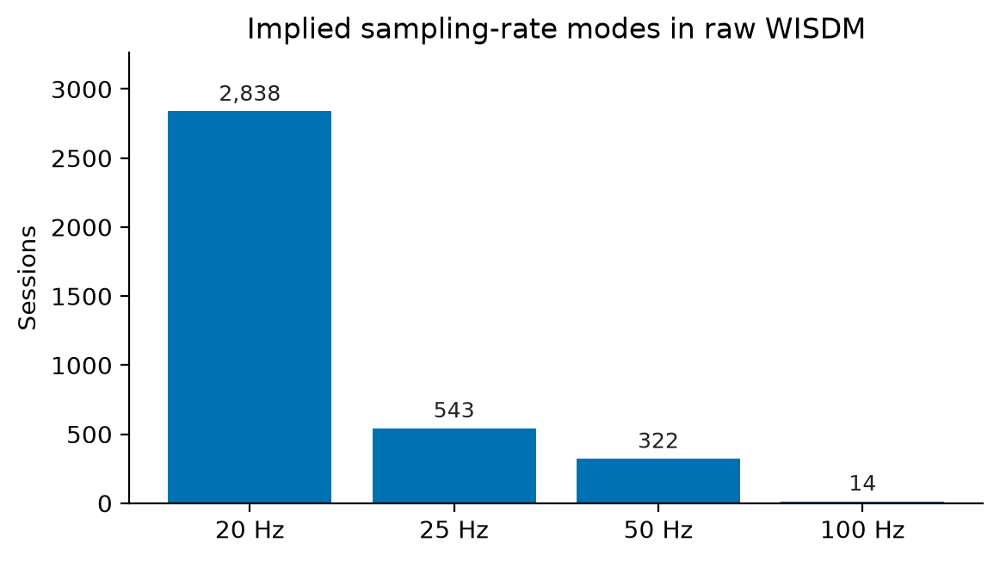
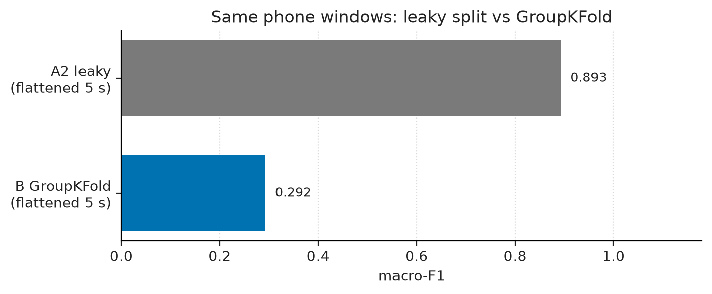
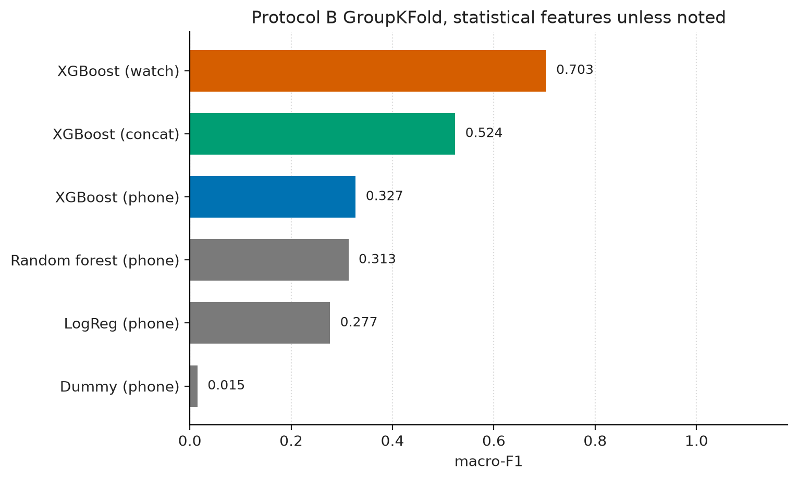
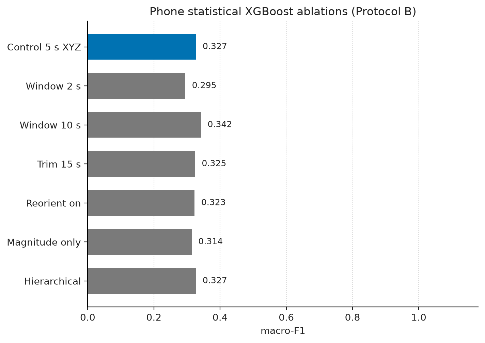
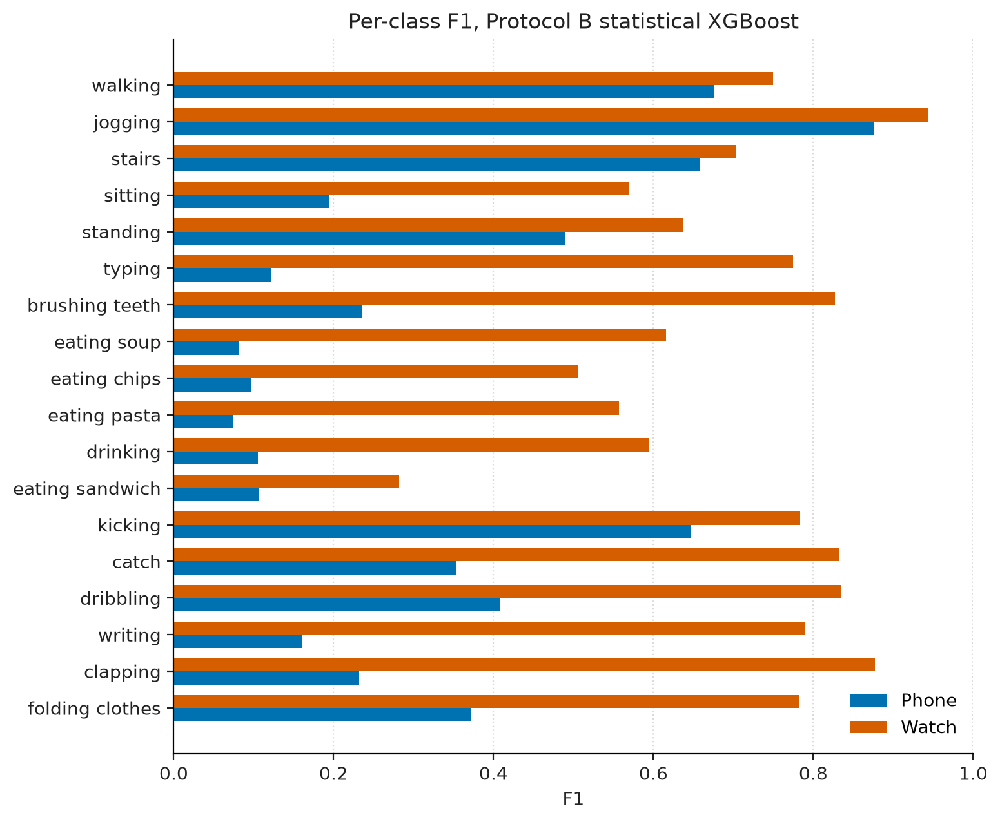
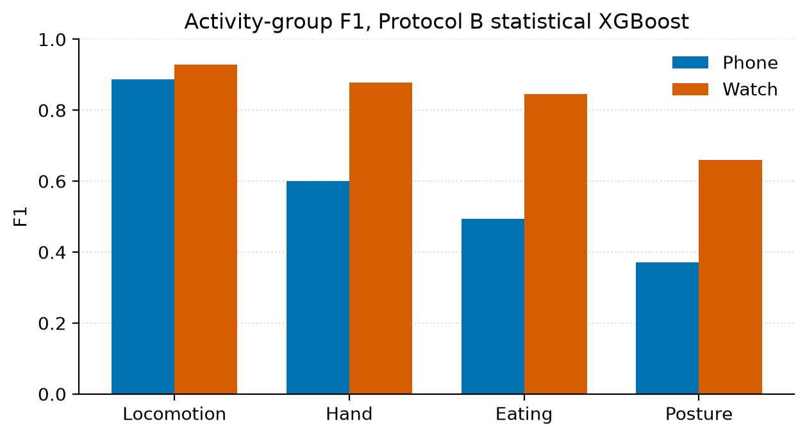
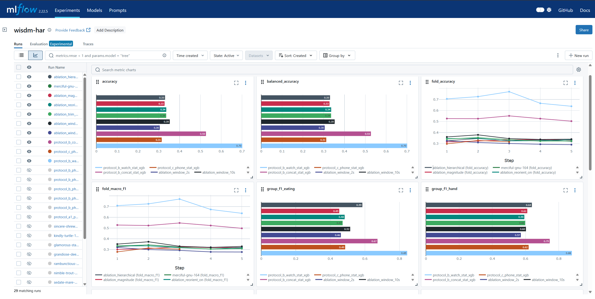
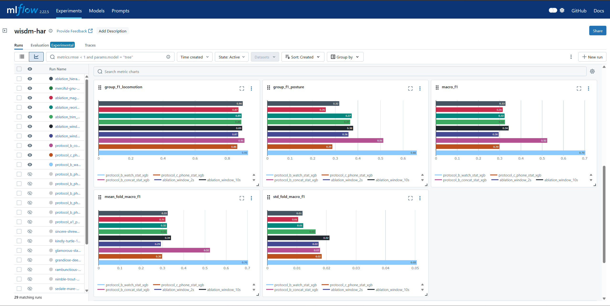

# Subject-independent HAR on WISDM

A student phone-only XGBoost notebook reported **0.8559 accuracy** on WISDM (`notebooks/archive/student_evaluation.txt`). That split shuffled overlapping windows with the same people in train and test. On repaired 20 Hz phone data, the same flattened 5 s windows score **0.8925 macro-F1** under that leaky split (`configs/protocol_a2_phone_raw_flat_xgb.yaml`) and **0.2924** when subjects are held out (`configs/protocol_b_phone_raw_flat_xgb.yaml`). The honest 18-class number that matters is watch statistical XGBoost: **0.7031 macro-F1** under 5-fold GroupKFold (`configs/protocol_b_watch_stat_xgb.yaml`).

Primary metric is **macro-F1**. Accuracy is secondary. Every cell names a protocol and a config. Numbers are full 51-subject UCI 507, repaired to 20 Hz.

## Dataset

[WISDM Smartphone and Smartwatch Activity and Biometrics Dataset (UCI 507)](https://archive.ics.uci.edu/dataset/507/wisdm+smartphone+and+smartwatch+activity+and+biometrics+dataset): 51 subjects (1600-1650), 18 activities (A-S skipping N), phone in pocket and watch on the dominant hand, accelerometer and gyroscope.

This dump matches Weiss row counts exactly (**15,630,426**). The archived notebook concatenated **15,649,253** rows. Audit summary: `docs/data_card.md`.

| Stream | Rows |
|--------|------|
| phone accel | 4,804,403 |
| phone gyro | 3,608,635 |
| watch accel | 3,777,046 |
| watch gyro | 3,440,342 |

Raw sessions are not 20 Hz throughout. Implied Hz clusters at **20** (2,838 sessions), **25** (543), **50** (322), and **100** (14). A 200-row official ARFF window is 10 s at 20 Hz and about 4 s at 50 Hz, so windowing by row count mixes time scales.



**35** subject x activity x stream cells are empty. Phone accel gaps include 1609 B, 1616 B and F, 1642 C and F, plus other holes in the 18-class grid. See `docs/data_card.md` for the full list.

There are no demographics, so there is no fairness slice.

## Method

Repair (`python -m har.data.repair`, `configs/default.yaml`) interpolates each `(subject, activity, device)` session onto a shared **20 Hz** grid, aligns accel and gyro by coverage intersection (not an exact-timestamp join), leaves phone-accel reorient **off**, and does not trim the start of the trial.

Windows are **5.0 s** with a **1.0 s** hop, built inside one session. They never slide across subject or activity boundaries. Default features are 104-dimensional statistical summaries (per-axis moments, magnitude, pairwise correlations). Flattened raw windows exist only to compare against the student representation.

Models on the honest ladder: stratified dummy, logistic regression, random forest, XGBoost (200 trees, `max_depth` 6). Protocol A clones the student 982-tree family. A two-stage group-then-expert head was tried and did not beat flat 18-way macro-F1. Gradient boosting on repaired session features beat the other classical models, so no 1D CNN or TCN is shipped.

Protocols (`docs/protocol.md`):

| Protocol | Split | Role |
|----------|--------|------|
| A1 | leaky `train_test_split` on 80-sample / hop-40 windows | Closest clone of `notebooks/archive/PhoneXGB2.ipynb` |
| A2 | leaky split on 5 s / 1 s flattened windows | Same representation as honest B flatten |
| B | 5-fold GroupKFold on `subject_id` | Main table |
| C | 46/5 grouped holdout, 3 repeats from one seed | Phone holdout check; not 51-fold LOSO |

Scalers, encoders, and early stopping fit on training subjects only, except Protocol A, which copies the notebook and early-stops on the test set.

## Results

### Leaky clone vs the student notebook (phone, flattened)

| Protocol | Config | Model | macro-F1 | Accuracy |
|----------|--------|-------|----------|----------|
| Student notebook | `notebooks/archive/student_evaluation.txt` | xgboost | (not reported) | 0.8559 |
| A1 leaky | `configs/protocol_a1_phone_raw_flat_xgb.yaml` (`docs/reports/protocol_a1_phone_raw_flat_xgb.json`) | xgboost (982 trees) | 0.8490 | 0.8475 |

A1 is the 80-sample clone. It is not the same window geometry as A2. Do not treat A2 vs 0.8559 as a leakage-only delta: the student matrix was unrepaired and concat-windowed.

### Same representation, leaky vs grouped (phone, 5 s / 1 s, `raw_flat`)

| Protocol | Config | Model | macro-F1 | Accuracy |
|----------|--------|-------|----------|----------|
| A2 leaky | `configs/protocol_a2_phone_raw_flat_xgb.yaml` (`docs/reports/protocol_a2_phone_raw_flat_xgb.json`) | xgboost (982 trees) | 0.8925 | 0.8913 |
| B GroupKFold | `configs/protocol_b_phone_raw_flat_xgb.yaml` (`docs/reports/protocol_b_phone_raw_flat_xgb.json`) | xgboost (982 trees) | 0.2924 | 0.3047 |



That drop is the leakage finding.

### Protocol B, statistical features, GroupKFold 5

| Device | Config | Model | macro-F1 | Accuracy |
|--------|--------|-------|----------|----------|
| phone | `configs/protocol_b_phone_stat_dummy.yaml` (`docs/reports/protocol_b_phone_stat_dummy.json`) | dummy | 0.0151 | 0.0551 |
| phone | `configs/protocol_b_phone_stat_logreg.yaml` (`docs/reports/protocol_b_phone_stat_logreg.json`) | logreg | 0.2767 | 0.2799 |
| phone | `configs/protocol_b_phone_stat_rf.yaml` (`docs/reports/protocol_b_phone_stat_rf.json`) | rf | 0.3131 | 0.3252 |
| phone | `configs/protocol_b_phone_stat_xgb.yaml` (`docs/reports/protocol_b_phone_stat_xgb.json`) | xgboost (200 trees) | 0.3272 | 0.3382 |
| watch | `configs/protocol_b_watch_stat_xgb.yaml` (`docs/reports/protocol_b_watch_stat_xgb.json`) | xgboost (200 trees) | 0.7031 | 0.7013 |
| both (stacked 6-channel windows, not 12-channel fusion) | `configs/protocol_b_concat_stat_xgb.yaml` (`docs/reports/protocol_b_concat_stat_xgb.json`) | xgboost (200 trees) | 0.5236 | 0.5267 |



Statistical phone XGBoost (0.3272) beats flattened raw under the same protocol (0.2924). Watch is the device that actually classifies 18 activities. Concat is extra rows from both devices, still 6 channels per window.

### Protocol C (phone statistical XGBoost, 46/5 x 3)

| Protocol | Config | Model | macro-F1 | Accuracy |
|----------|--------|-------|----------|----------|
| C grouped_holdout | `configs/protocol_c_phone_stat_xgb.yaml` (`docs/reports/protocol_c_phone_stat_xgb.json`) | xgboost (200 trees) | 0.2985 | 0.3140 |

Headline `macro_f1` is the unweighted mean of repeats. It tracks Protocol B phone (0.3272), not Protocol A.

### Protocol B ablations (phone statistical XGBoost)

Full table and per-group F1: `docs/reports/ablations.md`. Same GroupKFold and 200-tree family as `configs/protocol_b_phone_stat_xgb.yaml`.

| Setting | Config | macro-F1 | Eating group F1 |
|---------|--------|----------|-----------------|
| Control 5 s XYZ | `configs/protocol_b_phone_stat_xgb.yaml` | 0.3272 | 0.4945 |
| Window 10 s | `configs/ablations/window_10s.yaml` | 0.3422 | 0.5151 |
| Window 2 s | `configs/ablations/window_2s.yaml` | 0.2951 | 0.4610 |
| Trim 15 s | `configs/ablations/trim_15s.yaml` | 0.3247 | 0.4712 |
| Reorient on | `configs/ablations/reorient_on.yaml` | 0.3230 | 0.4830 |
| Magnitude only | `configs/ablations/magnitude.yaml` | 0.3142 | 0.4516 |
| Hierarchical | `configs/ablations/hierarchical.yaml` | 0.3271 | 0.5855 |



rWISDM-style reorient and a 15 s start trim do not beat the unreoriented, untrimmed 5 s control on 18-class phone GroupKFold. The two-stage head does not beat flat 18-way on macro-F1; eating group F1 rises from 0.4945 to 0.5855. 10 s windows are the only row that clearly beats 5 s (0.3422). Defaults stay 5 s, `reorient: false`, `trim_start_s: 0.0`.

Rebuild the compact ladder and the README figures:

```bash
python -m har.evaluate --from-reports docs/reports
python -m har.eval.plots --from-reports docs/reports --out docs/figures --sync-mlflow
```

## Failure cases

Pocket phone IMU under Protocol B (`configs/protocol_b_phone_stat_xgb.yaml`) can tell locomotion as a group (F1 0.8873) and still cannot name eating or sitting. Per-class F1: eating pasta 0.0749, soup 0.0807, chips 0.0964, drinking 0.1050, sandwich 0.1064, sitting 0.1943. Stairs (0.6588) and kicking (0.6470) are the weakest locomotion classes; they are not the worst overall.

Watch on the dominant hand (`configs/protocol_b_watch_stat_xgb.yaml`) flips that picture: locomotion 0.9292, hand 0.8788, eating 0.8450, posture 0.6606. Stairs is 0.7028 and kicking 0.7831. The hard class is sandwich (0.2816). Do not serve a phone window to a watch bundle.





Confusion among walking / jogging / stairs, and among the eating cluster, is the pattern the leaky notebook already flagged. Under a subject-independent split those errors survive; the 0.89 leaky score does not.

## Reproduce

Python 3.10+. Raw WISDM is gitignored. Expected sentinel after extract:

```text
data/external/wisdm-dataset/raw/phone/accel/data_1600_accel_phone.txt
```

```bash
python -m venv .venv
source .venv/Scripts/activate  # Windows Git Bash; otherwise source .venv/bin/activate
python -m pip install --upgrade pip
make install
```

Zip URL lives in `configs/audit.yaml`. Layout notes: `data/README.md`.

```bash
python -m har.data.download   # skips if the sentinel exists; not used in CI
make audit                    # data/audit/*.csv and docs/data_card.md
make prepare                  # 20 Hz parquet under data/processed/ (gitignored)
make train CONFIG=configs/protocol_b_watch_stat_xgb.yaml
make eval
make figures
make test                     # fixtures only; no WISDM
```

Full 51-subject XGBoost is an overnight local run, not CI. GitHub Actions runs ruff and pytest on committed fixtures.

```bash
python -m ruff check src tests
python -m ruff format --check src tests
python -m mlflow ui --backend-store-uri mlruns
```

MLflow runs are named after the config stem (`protocol_b_watch_stat_xgb`, `ablation_window_10s`, ...). Each run logs `fold_macro_f1` by fold, `group_f1_*`, a per-class F1 bar, and a confusion matrix. The README charts in `docs/figures/` are built from `docs/reports/` so they stay aligned with the tables.





Archived notebooks under `notebooks/archive/` still expect `data/processed/raw.csv` / `arff.csv` from the old loader. They are not the training path.

## API

CPU service for one 5 s, 20 Hz window (`T=100`, `C=6`). Default bundle is watch statistical XGBoost. Details: `serving/README.md`, `docs/model_card.md`.

```bash
python -m har.models.export --config configs/protocol_b_watch_stat_xgb.yaml --out models/watch_stat_xgb.onnx
export HAR_MODEL_PATH=models/watch_stat_xgb.onnx
make serve
```

```http
GET  /health -> {"status": "ok", "model_id": "..."}
GET  /labels -> {"codes": [...], "names": {...}, "groups": {...}}
POST /predict
```

```bash
python -c "import json,urllib.request; body=json.dumps({'device':'watch','hz':20,'channels':['ax','ay','az','gx','gy','gz'],'samples':[[0,0,0,0,0,0]]*100}).encode(); req=urllib.request.Request('http://127.0.0.1:8000/predict', data=body, headers={'Content-Type':'application/json'}); print(json.load(urllib.request.urlopen(req)))"
```

Wrong `T`, `C`, `device`, or `hz` is 422. `abstained` is true when `max(proba)` is below the bundle threshold (default 0.0, never abstain).

## Limits and next steps

- No subject demographics; cannot slice by sex, handedness, or phone model.
- Concat is stacked 6-channel windows, not time-aligned 12-channel phone+watch fusion.
- Protocol C is 46/5 x 3, not 51-fold LOSO. Nested XGBoost validation is one held-out **train** subject, not a separate val cohort.
- Served ONNX is a refit on all windows (one subject held out only for early stopping). Cite GroupKFold numbers from the metrics JSON, not from export.
- Abstain is uncalibrated. Statistical features still run in Python; only the tree head is ONNX.
- 10 s windows beat 5 s on phone GroupKFold by about 1.5 macro-F1 points. Changing the default is a product choice, not a free lunch on latency.

More on protocol, defects of the archived notebooks, and the served bundle: `docs/protocol.md`, `docs/limitations.md`, `docs/model_card.md`.

## License

MIT License. See `LICENSE`.
